<!-- ==================== BANNER (THEME AWARE) ==================== -->
<picture>
  <source media="(prefers-color-scheme: dark)" srcset="./dark.svg">
  <source media="(prefers-color-scheme: light)" srcset="./light.svg">
  
</picture>

  

<!-- ==================== SOCIAL BADGES ==================== -->

  &nbsp;&nbsp;
  &nbsp;&nbsp;
  &nbsp;&nbsp;
  

 

<!-- ==================== CONTRIBUTION SNAKE ==================== -->
<!-- NOTE: The output branch is created after the GitHub Action runs for the first time. -->
<picture>
  <source media="(prefers-color-scheme: dark)" srcset="https://raw.githubusercontent.com/Prasanna-ETH/Prasanna-ETH/output/github-contribution-grid-snake-dark.svg">
  <source media="(prefers-color-scheme: light)" srcset="https://raw.githubusercontent.com/Prasanna-ETH/Prasanna-ETH/output/github-contribution-grid-snake-light.svg">
  
</picture>

